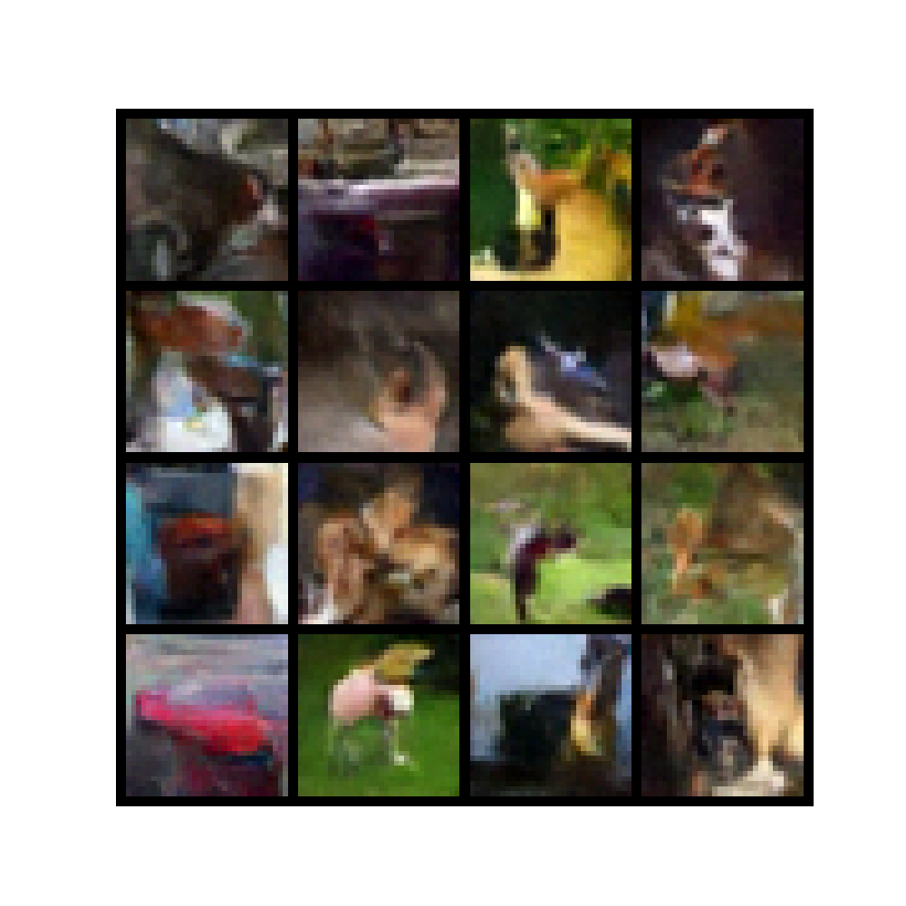
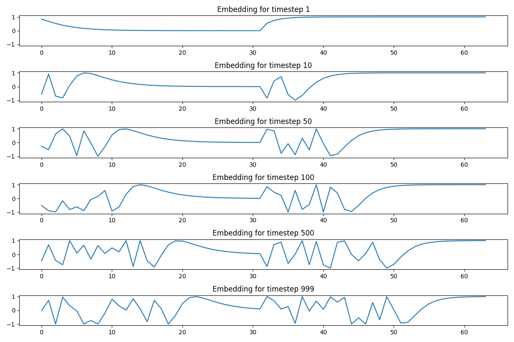

so i'll start by explaining the objective, how we diffuse and denoise to learn a distribution approximating the one our training dataset is sampled from. the model we're talking about is DDPM and in the paper, is explained through an unconditional lens, so i won't talk about how to condition the model (classifier free guidance and classifier guidance) with text (clip) or images (ip adapter). also, if you want great visualizations over what the processes which take place in DDPM's, i'd highly recommend reading https://erdem.pl/2023/11/step-by-step-visual-introduction-to-diffusion-models.

in this poast ill go through how diffusion works intuitively and then architect a model from scratch in < 200 lines of code, to get outputs below for example. the model is trained on the CIFAR-10 dataset of 3232 images.

later diffusion model implementations like latent diffusion model used by stable diffusion use vae's to allow for bigger images, and more comprehensive images with attention mechanisms which allows the model to understand relationships between pixels far away, which is something convolution alone is bad at handling. the original paper covering ddpm does not incorporate either of these, so i won't either. maybe for a later time.

diffusion in physics refers to the movement of particles from an area of high concentration to an ara of low concentration. basically, it's a process that transforms complex arrangements into simpler ones over time. we can use this idea to learn a distribution of images by diffusing (adding noise to) an image in a training set. in the physical world, diffusion cannot be reversed which is why eventually the universe will go into a heat death where all particles are uniformly distributed. this is bc in the real world, information about previous states is lost and can't be tracked with 100% accuracy, and with there being a basically infinite number of arrangements of particles at any given moment, trying to approximate states further and further in time become exponentially harder. in the digital world though, the state changes of a system can be tracked with exact accuracy, so when we go from x_t-1 to x_t (e.g. adding noise to an image), we know the exact noise / entropy which was added to this variable x. by knowing the exact noise added, we know the exact noise we must remove to go from x_t to x_t-1. and because we know how to go from x_t to x_t-1, and x_t-1 to x_t-2, and x_1 to x_0, we actually know how to go from x_t to x_0 (e.g. going from our final noisy image to our original image). now this means we know how to derive a loss function, and we know the differentiable network which generated this loss, so we have a way to learn a reverse decoder to denoise the noise added to the images in our training set in the diffusion process. our loss function can simply be the mse difference in the predicted image p(x_t, t), and our actual image x_0. to clarify a diffusion model is fundamentally two things: a diffuser and a denoiser. the diffuser is the forward process and the denoiser is the reverse decoding process. what we're learning is how to denoise a noisy image, so we're learning a model that is the reverse decoder/denoiser. we don't "learn" a model for diffusing.

in a diffusion model, we go from a complex, unknown distribution (image of cats), to a known, simpler distribution (normal distribution). intuitively, this is easy to do. you just add the proportion weighted values from 1 distribution to an original value sampled from the unknown distribution, and iteratively do this. e.g. x_0=sample_from_unknown_distribution x_1 = (1-variance) times x_0 + variance times e_1 (where e is sampled from a distribution mean 0 and unit variance). x_2 = (1-variance) times x_1 + variance times e_2, ... x_t = (1-variance) times x_t-1 + variance times e_t. after t steps, we can be sufficiently sure that all the original signal of x_0 is lost entirely, and so we can say x_t = e (x_t is sampled from a normal distribution, the same distribution e was sampled from). this function q(x_t | x_t-1) is called a transition kernel. any sample from any distribution will converge to the mean of the simpler distribution.

q(x_t | x_t-1) = sqrt(1-variance) times x_t-1 + sqrt(variance) times e

since we know how x_t depends on x_t-1, and how x_t-1 depends on x_t-2 we can make a function q(x_t | x_0) instead, with a_t = product of (1-b_t) for t from t=1 to t=T.

q(x times t | x_0) = sqrt(a_t) times x_0 + sqrt(1-a_t) times e

keep in mind, this process is running for every pixel and for every channel. so x_t is dimensions (3, 32, 32) for a 32x32 RGB image

this is the entire diffusion process, otherwise known as the forward process. although we call the whole thing a diffusion model, the diffusion is hapepning in this forward process. now to describe the variance across time. how the variance is changed as a function of t is called the models "schedule". a few examples are linear scheduling, exponential scheduling and cosine scheduling, but as long as you understand these are just different functions to derive a variance for t=1 to t=T that's all that matters.

the linear scheduler function is b_t = b_start + t times (b_end-b_start)/T

where b_start can be 0.0001 and b_end 0.02 for example.

but why does b_t vary to the timestep and why is it not invariant to t? to understand why variance is a function of time, and why in the forward process, the variance starts low and increases until time t (schedulers have different slopes at different t's, but all go from a low value to a high one) we need to understand why learning rate changes as a function of the training step in models. also, understanding why there are difffeent optimization algorithms for training and how they effect the step size "scheduling" can help understand why there are multiple different types of variance schedulers in the diffusion process.

the variance scheduler in the forward diffusion process of diffusion models and the learning rate in training models both fundamentally do the same thing: determining how quickly distributions change at each time increment / step.

diffusions forward process is effectively an information destruction schedule (w.r.t the distribution we aim to learn) and the learning rate is an information acquisition schedule.

the objective for any step either in training or diffusion is controlled entropy management. controlled entropy flow prevents information collapse or explosion which allows us to maintain a learnable path between structure and randomness.

now that we have gone from x_0 to x_t (a sample from our unknown distribution to a sample of a normal distribution) we need to learn how to go from a sample of a normal distribution to a sample from an approximation of our unknown distribution.

before we get to how learning happens we need to understand what is being learned. although noise is removed incrementally just as noise was added incrementally, the model we train isn't training this expected noise difference between x_t and x_t-1. like we mentioned above, it's predicting the entire noise from x_t to x_0. what determines how much of this noise we remove from the image is called the "sampler". just as there's many different types of schedulers for adding noise over time, there's many different samplers for how to remove noise over time.

doing denoising is a stochastic process, which means even if we start with the same noisy image input, and the same number of steps and using the same model, the outputted image will be different. this is because we consider the output of model to act as a mean, and a scaled random variable sampled from a normal distribution is added to it to add stochasticity.

typically, the sampler function is a function of b_t. the original sampler is called DDPM or Denoising Diffusion Probabilistic Model. this is actually the name of the entire model in the og paper but since there were other samplers that came out later like DDIM for example, the sampler used in the original paper is referred to as DDIM. the DDPM sampler is:

mean_theta(x_t, t) = 1/sqrt(1-b_t) times (x_t - (b_t/(sqrt(1-a_t))) times e_theta(x_t, t))

this looks super daunting probably but it's pretty simple. let's go from the inside out. so e_theta is our actual model which we're training. it is outputting the prediction of the entire noise in the image. everything else is the sampler. so basically, the directionality of the vector that points in the direction of x_t-1 from x_t is consistent across all samplers for all t. what is different, is the scale / step size in that direction. for this DDPM sampler we multiply this total noise prediction by the signal lost when going from step t-1 to t in training (assuming we are using the same scheduler on inference as we are using at inference) divided by the total noise lost after t steps. so this fraction is giving us a decimal number which indicates the proportion of noise that was lost from the move from x_t-1 to x_t relative to the total amount of noise lost after t steps from x_0 to x_t. we're subtracting this from x_t, which is our current image. and we're multiplying this by 1/(sqrt(1-b_t)) because we're restoring the signal magnitude we took from the image x_t-1 when moving to x_t in the noising process. so this whole function reads as the mean for x_t equals the current image minus the scaled noise prediction after having its signal scaling restored. now we have a mean, and remember, we want to have a variance we can use to sample from this distribution to determine our image at time t-1. the mean is a learned variable because it is a function of the model, but the variance in the paper is not. the variance simply equals sqrt(b_t) for all image dimensions. also, it's important to note, which i have yet to note that the variance b_t is invariant to the pixel or channel of the image, it's only dependent on the timestep, so when we get a 0.365 output for the variance at a given step for example, that same variance is used for all dimensions. but note, the mean for all image channels and pixels will be different.

we can think of different samplers like we think of different gradient optimization algorithms. for diffusion models the noise prediction that the model outputs remains the same regardless of the sampler, just like in back prop during training, the gradients of the model weights w.r.t the loss is the same no matter the optimization algorithm used. but both concern themselves with the scale of the informations influence on the path (i.e. neither optimization algorithms or a diffusion modelers sampler effect any steps directionality, but because they effect the scale of the step, the next state is altered, meaning they both effect the path/trajectory).

now the last concept we need to talk about before getting into the denoising model architecture is why we past in x_t AND t into the denoising model? we'll just talk about why conceptually, and in the architecture+code sections you'll see how it's implemented. the idea of including the timestep into the model is to give the model context on the progress of denoising. a high t, where t is close to T would give the model information that the entire image is basically noise, and it should construct patterns which alter each pixel value significantly, while a low t indicates that the current state of the image passed in is near its final destination, and the predicted noise pattern should be more carefully constructed. diffferent strategies at different stages: early denoising (high noise levels) might focus on rough structures and overall composition, while later denoising (low noise levels) might focus on fine details and textures. the timestamp helps the model apply the right strategy. this is essentially a way of encoding memory into the model. it doesn't know at any point where it started from in the denoising process, but by giving the model information on which step it is in, we're able to help it understand the level of noise remaining.

the code:

```py
class TimeEmbedding(nn.Module):
    def __init__(self, time_dim):
        super().__init__()
        self.time_dim = time_dim
        assert time_dim % 2 == 0, "time_dim must be even"

    def forward(self, t):
        device = t.device
        half_dim = self.time_dim // 2

        emb = math.log(10000) / (half_dim - 1)
        emb = torch.exp(torch.arange(half_dim, device=device) * -emb)

        t = t.unsqueeze(-1).float()

        emb = t * emb
        emb = torch.cat([torch.sin(emb), torch.cos(emb)], dim=-1)

        return emb
```

so first thing we can cover is the sinusoidal time encoding. it takes in a number between 1 and T, and outputs an embedding of dimensions tim_dim. each number in the embedding is a floating point number, and the combination of these floating point numbers form a unique vector for each time t inputted into this encoder function. this is very similar to the positional encoding that happens on transformer uncontextualized token embeddings before the attention layers. you can read about it here if you'd like https://erdem.pl/2021/05/understanding-positional-encoding-in-transformers#positional-encoding-visualization.



above is a visualization of the different embedding dimensions for a given timestep outputted by the positional encoder. the embedding for each t for t between 1 and T acts as a signature of sorts, which allows the model to understand what this vector represents. and there is similarity in the signature/vectors between close timesteps. so for example t=49 and t=50 have cosine similarity values closer to 1 than say, t=50 to t=10 (the angle of separation is lower for t's closer together).

now there might be a few questions you have as to why we do this encoding in the first place. firstly, we want to generate a signature of sorts that has similar representations for close numbers. using their numeric scalar values as the representation (e.g. 1 dimensional vector where v=t) would fit the bill here, but another thing we want, is bounded values for each dimension to ensure training stability. 10 is just 10 times bigger than 1, and 50 is 5x bigger than 10. as a general rule in neural networks, you never want big numbers in the network. there's a lot of reasons like exploding gradients which make back prop not follow a consistent predictable path, and vanishing gradients when using activation functions that asymptote like tanh and sigmoid (e.g. the output of (tanh(100000) abd tanh(10000000000) is basically 0 even though the latter number is 100,000x's bigger than the former)). and domination of certain features. so if we represent/encode t as t in the network, and not as a bounded high dimensional embedding, then what's that to say about the networks consideration on the actual image import relative to the importance it places on the time encoding input.

you don't really need to know what this sinusoidal function is exactly, bc it could easily be replaced with another sinusoidal function and work all the same, u just need to understand why the function is sinusoidal, and why the time value is expressed in a high dimensional embedding in the network.

```py
class ConvBlock(nn.Module):
    def __init__(self, in_channels, out_channels, time_dim):
        super().__init__()
        self.conv1 = nn.Conv2d(in_channels, out_channels, 3, padding=1)
        self.norm1 = nn.BatchNorm2d(out_channels)
        self.conv2 = nn.Conv2d(out_channels, out_channels, 3, padding=1)
        self.norm2 = nn.BatchNorm2d(out_channels)
        self.time_mlp = nn.Linear(time_dim, out_channels)

    def forward(self, x, t_emb):
        h = F.silu(self.norm1(self.conv1(x)))

        time_emb = self.time_mlp(t_emb)
        time_emb = time_emb.view(-1, time_emb.shape[1], 1, 1)
        h = h + time_emb

        h = F.silu(self.norm2(self.conv2(h)))
        return h
```

the next thing to talk about is the conv block. you should be able to notice something in the forward function. the first convolution layer is extracting features from the input image at the given timestep independently of time. it's just looking at spatial patterns in the image data. after this convolution, we then convert the time to the shape of out channels through a learned mlp. you might be wondering, why do we convert the time embedding which has dimensionality of time_dim, to a new dimensionality of out_channels, instead of just making time_dim = out_channels? there are multiple reasons, but for 1, we're not running just one conv block in the model, but multiple times in down sampling and in upsampling in the unet with varying dimensionality. and we need to allow the model to learn a mapping for a representation for the same time through different dimensions. the time encoding is just the base representation which is used to derive the actual representation through the learned time_mlp.

then we combine the output of the first convolution layer after being normalized and passed through the nonlinear activation function with the time_emb outputted from the time_mlp. we then do the same thing for this h with the second conv layer to get the output of this conv block. now let's break into the heart of ddpm (and all diffusion models), the unet. the unet is called a "U"-Net because it is shaped like a U. it starts for any given steps with downsampling, then it passes through the bottleneck, and then it does upsampling. and the skip connections in the network could be thought of as cords holding two two sides of the U together.

```py
class UNet(nn.Module):
    def __init__(self, in_channels=3, time_dim=256, device="cuda"):
        super().__init__()
        self.device = device

        # Time embedding
        self.time_embedding = TimeEmbedding(time_dim)

        # Downsampling path
        self.down1 = ConvBlock(in_channels, 64, time_dim)
        self.down2 = ConvBlock(64, 128, time_dim)
        self.down3 = ConvBlock(128, 256, time_dim)
        self.down4 = ConvBlock(256, 512, time_dim)

        # Pooling
        self.pool = nn.MaxPool2d(2)

        # Bottleneck
        self.bottleneck = ConvBlock(512, 1024, time_dim)

        # Upsampling path
        self.up4 = nn.ConvTranspose2d(1024, 512, 2, stride=2)
        self.conv_up4 = ConvBlock(1024, 512, time_dim)

        self.up3 = nn.ConvTranspose2d(512, 256, 2, stride=2)
        self.conv_up3 = ConvBlock(512, 256, time_dim)

        self.up2 = nn.ConvTranspose2d(256, 128, 2, stride=2)
        self.conv_up2 = ConvBlock(256, 128, time_dim)

        self.up1 = nn.ConvTranspose2d(128, 64, 2, stride=2)
        self.conv_up1 = ConvBlock(128, 64, time_dim)

        # Output layer
        self.output = nn.Conv2d(64, in_channels, 1)

    def forward(self, x, t):
        # Time embedding
        t_emb = self.time_embedding(t)

        # Downsampling
        d1 = self.down1(x, t_emb)
        x = self.pool(d1)

        d2 = self.down2(x, t_emb)
        x = self.pool(d2)

        d3 = self.down3(x, t_emb)
        x = self.pool(d3)

        d4 = self.down4(x, t_emb)
        x = self.pool(d4)

        # Bottleneck
        x = self.bottleneck(x, t_emb)

        # Upsampling with skip connections
        x = self.up4(x)
        x = torch.cat([x, d4], dim=1)
        x = self.conv_up4(x, t_emb)

        x = self.up3(x)
        x = torch.cat([x, d3], dim=1)
        x = self.conv_up3(x, t_emb)

        x = self.up2(x)
        x = torch.cat([x, d2], dim=1)
        x = self.conv_up2(x, t_emb)

        x = self.up1(x)
        x = torch.cat([x, d1], dim=1)
        x = self.conv_up1(x, t_emb)

        # Output layer - predict the noise
        x = self.output(x)

        return x
```

so the first step, is getting the current time t's base encoding as we've described. the next step is down sampling. for every down sampling layer, we're decreasing the size of the image dimensions by 1/4 (w/2, h/2) by pooling, and increasing the channel dimensionality 3->64->128->256->512. the idea of why we're doing this to increase the receptive field of the neurons. this hierarchical approach gives the network the ability to learn hierarchical features. i won't be explaining convolutional layers in depth, so if you don't understand them watching this lecture from andrej karpathy would be useful https://www.youtube.com/watch?v=LxfUGhug-iQ&ab_channel=AndrejKarpathy

the last down sample happens at the bottleneck. and there is no pooling that happens at this layer. this is the transition point between down sampling and upsampling. it contains the most compressed representation of the image with the highest feature density. it's the point where the network has completely encoded the input before moving on to reconstructing it through up sampling. so now we have a w/16, h/16, 1024 representation of our image, and need to convert it back into w, h, 3, our original dimensionality through up sampling. you should notice something a little differnt from upsampling compared to down sampling. we're using skip connections the concatenate that levels down sample result with the upsample layer output. once we get to output, we're back at our w,h,3 dimensionality. so we have now gone from x_t to x_t-1, and need to repeat this t-1 more times to get the final output image.

now we just need to put it all together. everything so far is all we need to generate one denoise step on a noise input. but how do we learn this model i.e. what does the loss look like? what does sampling look like? and how do we use the scheduler and sampler in all of this?

```py
class DDPM:
    def __init__(self, noise_steps=1000, beta_start=1e-4, beta_end=0.02, img_size=32, device="cuda"):
        self.noise_steps = noise_steps
        self.beta_start = beta_start
        self.beta_end = beta_end
        self.img_size = img_size
        self.device = device

        self.noise_variance = torch.linspace(beta_start, beta_end, noise_steps).to(device)

        self.signal_rate = 1. - self.noise_variance

        self.cumulative_signal_rate = torch.cumprod(self.signal_rate, dim=0)

        self.sqrt_cumulative_signal = torch.sqrt(self.cumulative_signal_rate)
        self.sqrt_cumulative_noise = torch.sqrt(1. - self.cumulative_signal_rate)

    def noise_images(self, x, t):

        random_noise = torch.randn_like(x).to(self.device)
        signal_scaling = self.sqrt_cumulative_signal[t].view(-1, 1, 1, 1)
        noise_scaling = self.sqrt_cumulative_noise[t].view(-1, 1, 1, 1)
        noised_image = signal_scaling * x + noise_scaling * random_noise
        return noised_image, random_noise

    def sample(self, model, n):
        model.eval()
        with torch.no_grad():
            x = torch.randn((n, 3, self.img_size, self.img_size)).to(self.device)
            # Iterate from the highest noise level to the lowest
            for i in reversed(range(self.noise_steps)):
                # Create a batch of the same timestep
                t = torch.full((n,), i, device=self.device, dtype=torch.long)
                # Get the noise predicted by the model
                predicted_noise = model(x, t)
                # Get the denoising coefficients for this timestep
                noise_level = self.noise_variance[i]
                signal_keep_rate = self.signal_rate[i]

                if i > 0:
                    noise = torch.randn_like(x)
                else:
                    noise = torch.zeros_like(x)

                x = (1 / torch.sqrt(signal_keep_rate)) * (
                    x - (noise_level / torch.sqrt(1 - self.cumulative_signal_rate[i])) * predicted_noise
                ) + torch.sqrt(noise_level) * noise

            x = (x.clamp(-1, 1) + 1) / 2

            return x

    def p_losses(self, denoise_model, x_0):
        batch_size = x_0.shape[0]

        random_timesteps = torch.randint(0, self.noise_steps, (batch_size,), device=self.device).long()
        noisy_images, original_noise = self.noise_images(x_0, random_timesteps)
        predicted_noise = denoise_model(noisy_images, random_timesteps)

        loss = torch.nn.functional.mse_loss(original_noise, predicted_noise)
        return loss

    def train(self, denoise_model, dataloader, optimizer, num_epochs, save_path="models/ddpm_model.pth"):

        denoise_model.train()
        best_loss = float('inf')

        for epoch in range(num_epochs):
            epoch_loss = 0.0
            for batch_idx, (images, _) in enumerate(dataloader):
                images = images.to(self.device)

                optimizer.zero_grad()

                loss = self.p_losses(denoise_model, images)

                loss.backward()

                optimizer.step()

                epoch_loss += loss.item()

                if batch_idx % 100 == 0:
                    print(f"Epoch {epoch+1}/{num_epochs}, Batch {batch_idx}/{len(dataloader)}, Loss: {loss.item():.4f}")

            avg_epoch_loss = epoch_loss / len(dataloader)
            print(f"Epoch {epoch+1}/{num_epochs} completed. Average Loss: {avg_epoch_loss:.4f}")

            if avg_epoch_loss < best_loss:
                best_loss = avg_epoch_loss
                torch.save(denoise_model.state_dict(), save_path)
                print(f"Model saved at {save_path}")

        print("Training completed!")
        return denoise_model
```

this is where we put is all together. i've already explained in the beginning of the article what these variables are like the variance, the beta start and end for linear scheduling, the cumulative signal rate and so on so i won't explain that again. what we do need to go over though is how we train, and how we sample. so firstly, how do we train?

so all that is happening in this train function is we sample an image from our training dataset, and sample a t for t between 1 and T, and add the appropriate amount of noise for our given scheduler and t to this image. we then pass this noisy image into the model with the sampled t to get the models prediction of how much noise exists in the image. the mean square error different between the actual noise added to the image q(x*t | x_0) and our predicted noise added to the image ε*θ(x_0 | x_t, t) is calculated and outputted as our loss. we then perform back propagation on our unet and time_mlp, and rinse and repeat over our entire dataset x times where x = number of epochs.

now that we have a trained model, we need to run inference on it to sample from our learned distribution to output new images. we explained this above earlier where we use a certain sampler, which scales the output of the noise prediction model conditioned on the scheduler variance at the given timestep.

after starting with a randomly sampled noisy image sampled from a normal distribution, and T steps of denoising, we have our new image sample from our learned model.

sources:
arXiv:2006.11239
https://arxiv.org/pdf/2207.12598
https://lilianweng.github.io/posts/2021-07-11-diffusion-models/#reverse-diffusion-process
https://erdem.pl/2023/11/step-by-step-visual-introduction-to-diffusion-models
https://erdem.pl/2021/05/understanding-positional-encoding-in-transformers#positional-encoding-visualization
arXiv:2308.06721
